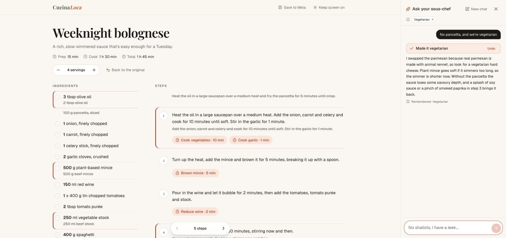
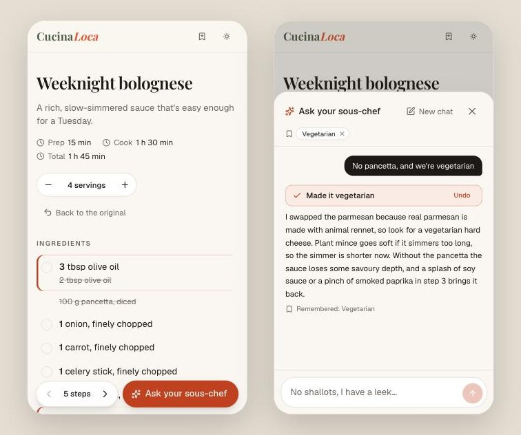
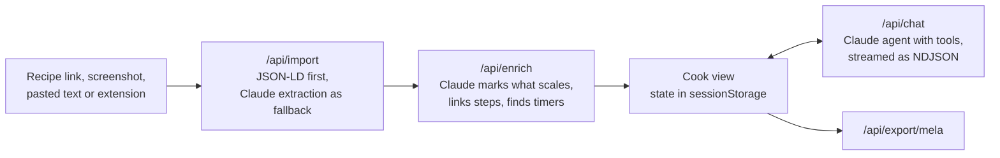

# Cucina Loca

**A chef in your kitchen.** Paste a recipe from any site and cook from a clean page, with a sous-chef you can ask to change it: out of shallots, cooking for six, vegetarian guests, only an air fryer. The recipe rewrites itself to match, and you see exactly what changed.

### 👉 Try it at [cucinaloca.com](https://cucinaloca.com)

Paste any recipe link, or put `cucinaloca.com/` in front of a recipe's address, e.g. `cucinaloca.com/https://www.bbcgoodfood.com/recipes/best-spaghetti-bolognese-recipe`. No sign-up. Nothing is saved: close the tab and the session is gone.



<p align="center"></p>

## What it does

- **Opens any recipe as a clean cook view.** Ingredients you can tick off, the current step in focus with the ingredients it needs, one-tap timers found in the method, servings scaling, and the screen kept awake.
- **Changes the recipe when you ask.** "Ask your sous-chef" edits the recipe itself rather than replying with advice you have to apply in your head. Every change shows inline against the original (old text struck through), each reply can be undone, and "Back to the original" is one tap away.
- **Remembers what matters, nothing else.** Lasting facts like "we're vegetarian" or "no stand mixer" stay in your browser for next time. Recipes and conversations are never stored.
- **Works where you are.**
  - On a phone: a share-sheet shortcut (`/shortcut`), or paste or prefix a link.
  - On a computer: a Chrome side-panel extension (`extension/`) that cooks the page you're on.
  - When a site blocks automated access: add screenshots or paste the text.
- **Keeps the good ones.** "Save to Mela" exports your adapted version, photo included, as a [`.melarecipe`](https://mela.recipes/fileformat/) file for the [Mela](https://mela.recipes) recipe app.

## How it works



**Import.** The server fetches the page (with SSRF protection: private and internal addresses are refused at connect time, including after redirects) and reads its schema.org JSON-LD. Pages without structured data, screenshots and pasted text go through Claude with structured outputs, which copies the recipe verbatim. Sites that refuse automated access (some answer HTTP 402) are respected, not worked around. The cook is offered screenshots or the extension instead, which read the page from their own browser.

**Enrichment.** Claude reads the recipe once and returns a template for every line, with only the amounts that should scale marked: `[[1.5]] cups ([[200]] g) flour` but `[[1]] (14-oz) can tomatoes`. Scaling then updates metric equivalents and amounts written inside steps too, and eggs round to whole numbers. Each template is checked word for word against the source, so the model can't quietly change the recipe.

**The sous-chef.** A Claude agent runs a streaming tool loop with three strict tools:
- `edit_recipe`: an atomic batch of typed operations on ingredients and steps.
- `set_servings`
- `remember_preference`

The same pure `applyChange()` validates each edit on the server and applies it in the browser, so both always agree. The server is stateless: every request carries the recipe and conversation from the tab.

**Chrome extension.** A Manifest V3 side panel frames the app and passes it the page the cook is looking at. It uses only `activeTab`, so it can read a page only when you click its icon. The app accepts that page only from an extension parent frame, and `frame-ancestors` limits who can frame it.

## Evals

The sous-chef has its own test suite in `evals/chat/`: 36 requests across 6 recipes written for it. They cover:
- swaps and missing ingredients
- diets and allergies with hidden sources (shrimp paste in curry paste, wheat in stock cubes)
- scaling and equipment
- questions that must leave the recipe alone
- seasonality by hemisphere
- French
- follow-ups that depend on earlier turns

The runner calls the real agent and applies its edits exactly as the browser does, then scores four things:

- **Correct edits** (code): the pancetta really is gone from every line, the scale is right, questions didn't touch the recipe, one-off situations weren't saved as preferences.
- **Style rules** (code): no markdown, no "I've swapped…", no sign-offs, no internal ids, no leaked working notes, length limits.
- **Chef approves** and **Sounds human**: Claude Sonnet 5.5 as judge, one property per call, with the candidate's text treated as data.

Before trusting the judges, the suite checks that they fail empty, evasive and confidently wrong answers (`npm run eval:chat -- --selftest`).

The first baseline found a real bug: text the model wrote before calling a tool, its working notes ("Or just remove it? They didn't say what they have…"), was reaching the cook in 13 of 72 runs. Only sending the text of the turn that ends the reply fixed it:

| 36 cases × 2 runs | Correct edits | Chef approves | Style rules | Sounds human |
|---|---|---|---|---|
| Baseline | 100% | 79% | 71% | 60% |
| Hide pre-tool text | 100% | 79% | 86% | 62% |

A full run costs about $1.60 and takes 3 minutes. It runs on demand (`npm run eval:chat -- --reps 2`, or Actions → "Eval sous-chef chat").

## Built with

- **App:** Next.js 16 (App Router, route handlers, `proxy.ts`), React 19, Tailwind CSS 4, Zod
- **AI:** Claude API with `claude-opus-5-5`, using:
  - structured outputs and vision
  - the SDK's streaming tool runner with strict Zod tools
  - prompt caching
  - server-side refusal fallback
- **Around it:** Upstash rate limiting, Vercel Analytics (page views only, no query strings), Vitest, and a Chrome MV3 extension

## Project layout

```
src/app/            pages (home, /cook, /shortcut, /extension) and API routes
src/components/     cook view, chat panel, Save to Mela, extension host
src/lib/recipe/     JSON-LD parsing, Claude import and enrichment, scaling, edits, diffs
src/lib/chat/       the sous-chef agent and its streaming protocol
src/lib/fetch-page  SSRF-safe page and image fetching
src/proxy.ts        cucinaloca.com/<recipe-url> → /cook?url=…
extension/          Chrome side-panel extension
evals/chat/         sous-chef eval: cases, recipes, graders, runner
test/               unit tests (Vitest)
```

## Run it locally

```bash
cp .env.example .env.local   # add ANTHROPIC_API_KEY
npm install
npm run dev                  # http://localhost:3000
npm test
```

To try the extension, load `extension/` unpacked at `chrome://extensions` (Developer mode). An unpacked copy talks to `http://localhost:3000`; a Web Store install talks to cucinaloca.com. `npm run ext:zip` builds the upload bundle.

## What's next

- Hands-free voice mode for cooking with messy hands.
- The Chrome Web Store listing for the extension.
- Fixes the evals point to:
  - letting the sous-chef rename a recipe it changed
  - showing it the original recipe so it can restore earlier amounts
  - fewer replies that open by restating the change
